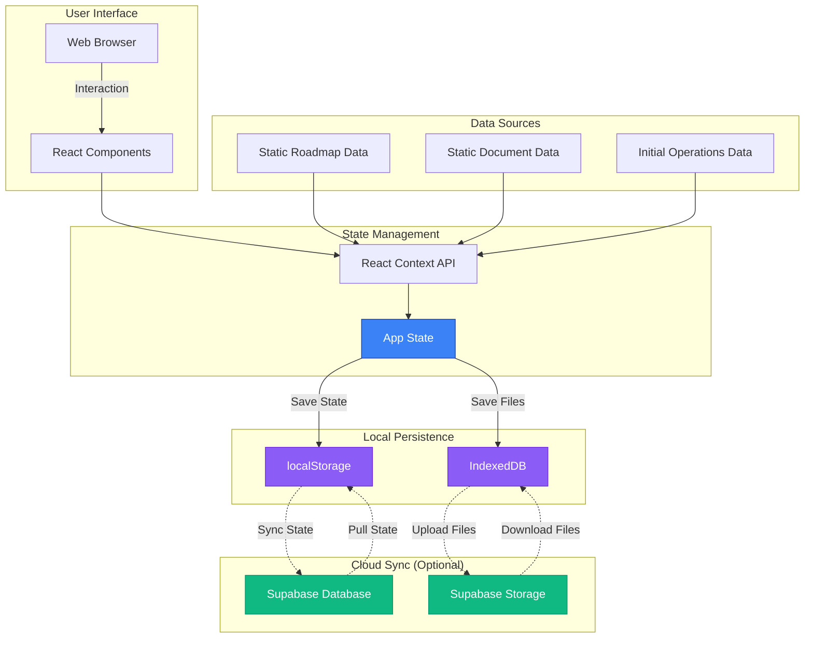
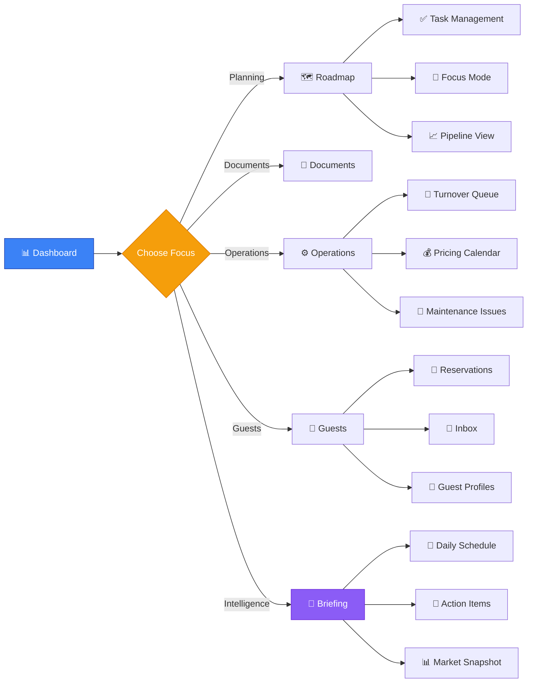
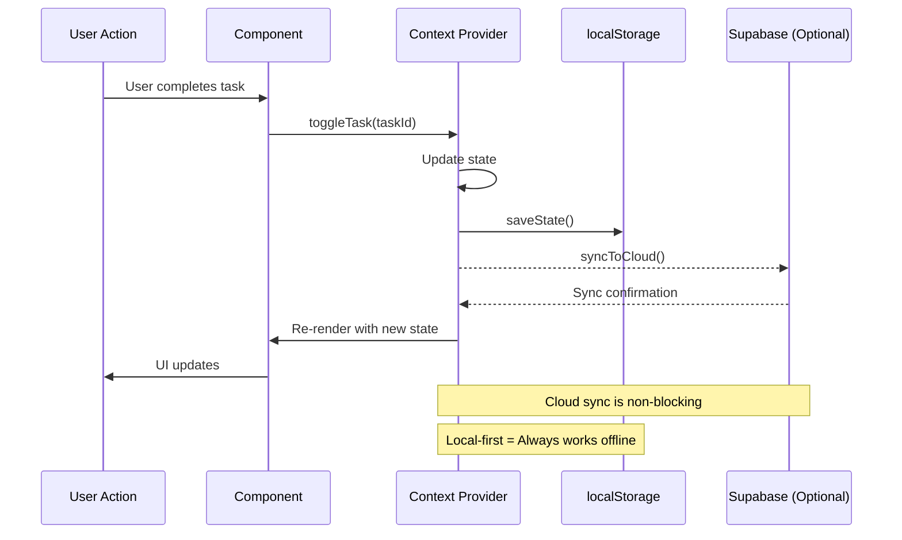
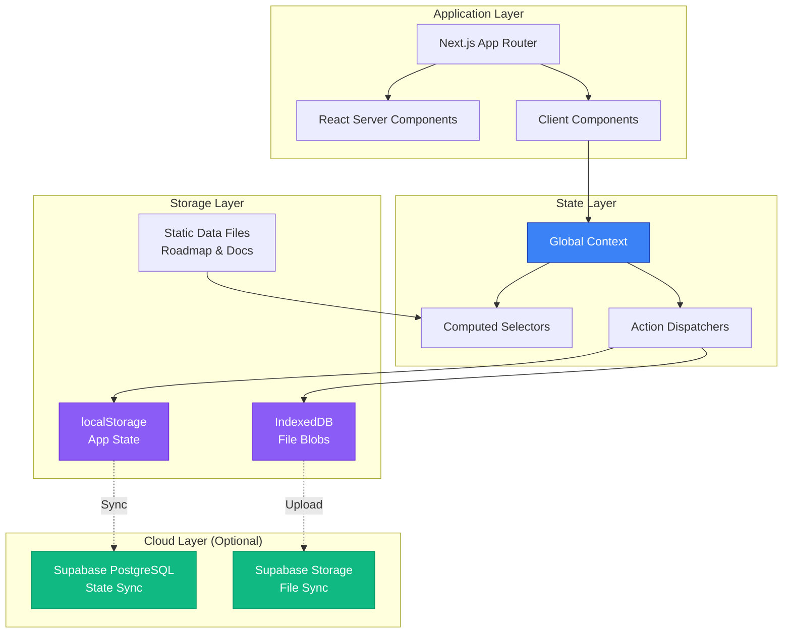
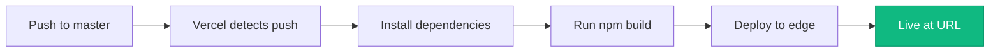

<div align="center">

# 🏠 STR Command Center

**Private short-term rental operations dashboard for tracking launch readiness, task execution, and documentation in one place.**

[](https://nextjs.org/)
[](https://react.dev/)
[](https://www.typescriptlang.org/)
[](https://tailwindcss.com/)
[](https://supabase.com/)

</div>

---

## 📋 Table of Contents

- [Overview](#-overview)
- [Application Workflow](#-application-workflow)
- [Architecture](#-architecture)
- [Key Features](#-key-features)
- [Tech Stack](#-tech-stack)
- [Getting Started](#-getting-started)
- [Pages & Routes](#-pages--routes)
- [Project Structure](#-project-structure)
- [Deployment](#-deployment)
- [Recent Updates](#-recent-updates)

---

## 🎯 Overview

**STR Command Center** is a Next.js application designed to streamline short-term rental operations from pre-launch planning through daily operations. Built with a **local-first architecture** and optional cloud sync, it provides comprehensive task management, document tracking, guest relations, pricing automation, and market intelligence—all in one unified dashboard.

### Core Capabilities

| Feature Category | Description |
|-----------------|-------------|
| 🗺️ **Launch Planning** | Roadmap execution, document completion, progress tracking |
| 🔄 **Operations Management** | Turnover tasks, maintenance issues, guest communications |
| 💰 **Revenue Optimization** | Dynamic pricing, performance reports, market intelligence |
| 🤖 **Intelligent Automation** | Smart triggers, daily briefings, automated insights |
| 📱 **Mobile-First Design** | Touch gestures, haptic feedback, responsive UI |

---

## 🔄 Application Workflow

### High-Level Data Flow



### User Journey Through Features



### State Management Flow



---

## 🏗️ Architecture

### Local-First Design



### Key Design Principles

- **📴 Offline-First**: Works without internet connection
- **🔄 Automatic Sync**: Optional cloud backup with conflict resolution
- **🎯 Type-Safe**: Centralized TypeScript types
- **📦 Modular**: Component-based architecture
- **🚀 Performance**: Static generation + client hydration

---

## ✨ Key Features

### Phase 1: Core Planning & Execution

<details>
<summary><b>📊 Dashboard</b></summary>

- Progress rings showing completion across sections
- Velocity tracking and trend analysis
- Critical path identification
- Blocked task warnings
- Launch countdown timer

</details>

<details>
<summary><b>🗺️ Roadmap Management</b></summary>

- Hierarchical task organization (sections → categories → tasks)
- Status tracking (default, in-progress, blocked, N/A)
- Rich task metadata (notes, checklists, attachments, priority)
- Task filtering and search
- Bulk operations and keyboard shortcuts

</details>

<details>
<summary><b>📄 Document Repository</b></summary>

- Multi-file drag-and-drop upload
- Automatic file deduplication (SHA-256 hashing)
- Auto-tagging and metadata extraction
- Master directory grouped by artifact type
- File preview and download

</details>

<details>
<summary><b>🎯 Focus Mode</b></summary>

- Blocked task prioritization
- In-progress task tracking
- Pinned task quick access
- Context-switching minimization

</details>

### Phase 2: Operational Excellence

<details>
<summary><b>🔄 Turnover Queue Management</b></summary>

- Task lifecycle: Queued → In Progress → Completed
- Priority levels and deadline tracking
- Checklist integration for standard procedures
- Time estimation and cost tracking
- Property-specific workflows

</details>

<details>
<summary><b>💰 Dynamic Pricing Calendar</b></summary>

- Month-by-month pricing grid
- Strategy presets (standard, peak, event, last-minute)
- Bulk editing for date ranges
- Pricing rules engine with conditions
- Historical price tracking

</details>

<details>
<summary><b>📊 Revenue & Performance Reports</b></summary>

- Multi-tab analytics (Overview, Revenue, Occupancy, Channels)
- Key metrics: ADR, RevPAN, Occupancy Rate
- Channel performance breakdown
- CSV export for external analysis
- Period comparisons (MTD, YTD, Custom)

</details>

<details>
<summary><b>🔧 Maintenance Issue Tracker</b></summary>

- Issue categorization and priority levels
- Status workflow with assignment tracking
- Cost estimation and actual cost tracking
- Photo attachments and notes
- Resolution history

</details>

<details>
<summary><b>👥 Guest Profile Management</b></summary>

- Guest flags (VIP, Repeat, Problematic)
- Communication history and preferences
- Lifetime value calculation
- Special requests tracking
- Review and rating history

</details>

### Phase 3: Intelligent Operations

<details>
<summary><b>🌍 Market Snapshot Dashboard</b></summary>

- Competitor tracking with price history
- Local event monitoring with impact assessment
- Market metrics (occupancy, demand index, ADR)
- Automated pricing recommendations
- Competitive intelligence reports

</details>

<details>
<summary><b>☀️ Morning Briefing System</b></summary>

- Personalized daily greeting
- Smart action items with priorities
- Today's schedule (check-ins, check-outs, tasks)
- Performance metrics summary
- Event notifications

</details>

<details>
<summary><b>🤖 Automation & Smart Triggers</b></summary>

- Configurable automation rules
- Trigger types: time-based, event-based, condition-based
- Action chains with multi-step workflows
- Execution logging and statistics
- Cooldown periods and constraints

</details>

<details>
<summary><b>📱 Mobile Optimization</b></summary>

- Touch-friendly tap targets (44px minimum)
- Swipe gestures for card interactions
- Pull-to-refresh on data views
- Long-press for contextual actions
- Haptic feedback support
- Safe area support for notches

</details>

<details>
<summary><b>⚙️ Property Settings & Configuration</b></summary>

- Multi-property support (future-proofed)
- Access information (WiFi, door codes, parking)
- Guest instructions and house rules
- Emergency contacts and vendor directory
- Property statistics and metrics

</details>

---

## 🛠️ Tech Stack

| Category | Technology | Purpose |
|----------|-----------|---------|
| **Framework** | Next.js 16.2.4 | App Router, SSR, Static Generation |
| **UI Library** | React 19 | Component architecture |
| **Language** | TypeScript | Type safety and developer experience |
| **Styling** | Tailwind CSS 3.4 | Utility-first styling |
| **State** | React Context API | Global state management |
| **Persistence** | localStorage | App state persistence |
| **File Storage** | IndexedDB | Binary file storage |
| **Cloud Sync** | Supabase (Optional) | PostgreSQL + Storage |
| **Deployment** | Vercel | Serverless deployment |

---

## 🚀 Getting Started

### Prerequisites

- **Node.js** 18+ (20+ recommended)
- **npm** 9+

### Installation

```bash
# Clone the repository
git clone <repository-url>

# Navigate to project directory
cd str-command-center

# Install dependencies
npm install
```

### Development

```bash
# Start development server
npm run dev

# Open browser
# Navigate to http://localhost:3000
```

### Production Build

```bash
# Create optimized production build
npm run build

# Start production server
npm start
```

### Available Scripts

| Script | Description |
|--------|-------------|
| `npm run dev` | Start development server with hot reload |
| `npm run build` | Create production build |
| `npm run start` | Start production server |
| `npm run lint` | Run ESLint checks |
| `npm run extract-data` | Run data extraction script |

---

## 🔐 Environment Variables

Create `.env.local` in the project root (copy from `.env.example`):

```bash
# Supabase Configuration (Optional - for cloud sync)
NEXT_PUBLIC_SUPABASE_URL=your-project-url
NEXT_PUBLIC_SUPABASE_ANON_KEY=your-anon-key
NEXT_PUBLIC_SUPABASE_STATE_KEY=family

# Supabase Storage (Optional)
NEXT_PUBLIC_SUPABASE_STORAGE_BUCKET=str-files
```

> **Note**: If not configured, the app works entirely offline with localStorage + IndexedDB.

---

## 📑 Pages & Routes

### Core Pages (Phase 1)

| Route | Page | Description |
|-------|------|-------------|
| `/` | Dashboard | Progress overview, metrics, critical path |
| `/roadmap` | Roadmap | Full task list with filtering and editing |
| `/documents` | Documents | Document repository with file uploads |
| `/focus` | Focus Mode | Blocked, in-progress, and pinned tasks |
| `/pipeline` | Pipeline | Task pipeline visualization |
| `/settings` | Settings | Configuration, import/export, launch date |

### Operations Pages (Phase 2)

| Route | Page | Description |
|-------|------|-------------|
| `/operations` | Operations | Turnover queue and task management |
| `/pricing` | Pricing | Dynamic pricing calendar with bulk editing |
| `/reports` | Reports | Revenue and performance analytics |
| `/issues` | Issues | Maintenance issue tracking |
| `/reservations` | Reservations | Booking management |
| `/guests` | Guests | Guest profiles and history |
| `/inbox` | Inbox | Message threads and communications |
| `/calendar` | Calendar | Unified calendar view |

### Intelligence Pages (Phase 3)

| Route | Page | Description |
|-------|------|-------------|
| `/market` | Market | Competitor tracking and event monitoring |
| `/briefing` | Briefing | Daily morning briefing with action items |
| `/automation` | Automation | Automation rules and execution logs |
| `/properties` | Properties | Property settings and configuration |

---

## 📁 Project Structure

```
.
├── public/                      # Static assets
├── scripts/                     # Utility scripts
├── src/
│   ├── app/                     # Next.js App Router pages
│   │   ├── automation/          # Automation rules management
│   │   ├── briefing/            # Daily briefing system
│   │   ├── calendar/            # Calendar view
│   │   ├── documents/           # Document repository
│   │   ├── focus/               # Focus mode
│   │   ├── guests/              # Guest management
│   │   ├── inbox/               # Messaging
│   │   ├── issues/              # Maintenance tracking
│   │   ├── market/              # Market intelligence
│   │   ├── operations/          # Operations tasks
│   │   ├── pipeline/            # Pipeline view
│   │   ├── pricing/             # Dynamic pricing
│   │   ├── properties/          # Property settings
│   │   ├── reports/             # Analytics & reports
│   │   ├── reservations/        # Booking management
│   │   ├── roadmap/             # Task roadmap
│   │   ├── settings/            # App settings
│   │   ├── globals.css          # Global styles + mobile utilities
│   │   ├── layout.tsx           # Root layout
│   │   └── page.tsx             # Dashboard (home)
│   ├── components/              # React components
│   │   ├── briefing/            # Briefing components
│   │   ├── layout/              # Navigation & layout
│   │   ├── market/              # Market components
│   │   ├── mobile/              # Mobile-specific components
│   │   ├── operations/          # Operations components
│   │   ├── tasks/               # Task components
│   │   └── ...                  # Other component directories
│   ├── data/                    # Static data definitions
│   │   ├── properties.ts        # Property definitions
│   │   ├── roadmap.ts           # Task roadmap structure
│   │   └── documents.ts         # Document artifacts
│   ├── lib/                     # Utilities and core logic
│   │   ├── briefing-utils.ts    # Briefing calculations
│   │   ├── context.tsx          # Global state management
│   │   ├── file-storage.ts      # IndexedDB file storage
│   │   ├── mobile-hooks.ts      # Mobile gestures & detection
│   │   ├── report-utils.ts      # Analytics calculations
│   │   ├── selectors.ts         # Computed state selectors
│   │   ├── storage.ts           # localStorage persistence
│   │   ├── supabase.ts          # Cloud sync integration
│   │   └── utils.ts             # General utilities
│   └── types/
│       └── index.ts             # Centralized TypeScript types
├── .env.example                 # Environment variable template
├── .gitignore                   # Git ignore rules
├── CLAUDE.md                    # AI agent instructions
├── next.config.js               # Next.js configuration
├── package.json                 # Dependencies and scripts
├── postcss.config.js            # PostCSS configuration
├── tailwind.config.js           # Tailwind CSS configuration
├── tsconfig.json                # TypeScript configuration
└── vercel.json                  # Vercel deployment config
```

---

## ☁️ Deployment

### Vercel Deployment



#### Recommended Settings

| Setting | Value |
|---------|-------|
| **Root Directory** | `.` (repository root) |
| **Install Command** | `npm install` |
| **Build Command** | `npm run build` |
| **Framework Preset** | Next.js |
| **Node Version** | 20.x |

#### Deployment Steps

1. **Connect Repository**
   ```bash
   # Push to master branch
   git push origin master
   ```

2. **Import to Vercel**
   - Go to [Vercel Dashboard](https://vercel.com)
   - Click "Import Project"
   - Select your repository

3. **Configure Environment Variables**
   - Add Supabase credentials (optional)
   - Set production environment variables

4. **Deploy**
   - Vercel auto-deploys on every push to `master`
   - View deployment logs in Vercel dashboard

---

## 📝 Recent Updates

### Phase 2 - Operational Excellence ✅

**Released: 2026-04-23**

<details>
<summary><b>Task #6: Turnover Queue Management</b></summary>

- **Types**: `OperationsTask`, task statuses (queued, in_progress, completed)
- **Components**: TaskCard, TaskDetailModal
- **Page**: `/operations` with status grouping and filtering
- **Features**: Priority badges, checklist tracking, cost estimation

</details>

<details>
<summary><b>Task #7: Dynamic Pricing Grid</b></summary>

- **Types**: `DailyPricing`, `PricingRule`, pricing strategies
- **Components**: PricingCalendar, BulkEditModal, PricingRules
- **Page**: `/pricing` with month navigation and property selector
- **Features**: Color-coded strategies, bulk editing, pricing rules manager

</details>

<details>
<summary><b>Task #8: Revenue & Performance Reports</b></summary>

- **Utils**: RevenueReport, OccupancyReport calculations
- **Components**: RevenueChart, ChannelBreakdown
- **Page**: `/reports` with multi-tab interface (overview, revenue, occupancy, channels)
- **Features**: CSV export, period selectors, key metrics (ADR, RevPAN, occupancy)

</details>

<details>
<summary><b>Task #9: Issue Logging & Maintenance Tracker</b></summary>

- **Types**: `MaintenanceIssue`, priority/status enums
- **Components**: IssueCard, IssueDetailModal
- **Page**: `/issues` with status workflow and filtering
- **Features**: Priority badges, cost tracking, issue categories, status progression

</details>

<details>
<summary><b>Task #10: Guest Profile Enhancement</b></summary>

- **Types**: `GuestProfile` with flags, preferences, spending
- **Components**: GuestCard, GuestProfileModal
- **Page**: `/guests` with filtering, sorting, and lifetime value metrics
- **Features**: VIP/repeat/problematic flags, preference tracking, communication history

</details>

---

### Phase 3 - Intelligent Operations ✅

**Released: 2026-04-23**

<details>
<summary><b>Task #11: Market Snapshot Dashboard</b></summary>

- **Types**: `MarketCompetitor`, `LocalEvent`, `MarketMetrics`
- **Components**: CompetitorCard, EventCard, MarketMetricsDisplay
- **Page**: `/market` with 3 view modes (overview, competitors, events)
- **Features**: Price trend tracking, event impact assessment, market insights generation

</details>

<details>
<summary><b>Task #12: Morning Briefing System</b></summary>

- **Utils**: `generateDailyBriefing()` with smart action items
- **Components**: ActionItems, TodaySchedule
- **Page**: `/briefing` with personalized daily summary
- **Features**: Action priorities, check-in/check-out scheduling, performance metrics

</details>

<details>
<summary><b>Task #13: Automation & Smart Triggers</b></summary>

- **Types**: `AutomationRule`, `AutomationLog`, trigger/action types
- **Pre-configured rules**: Task creation, price adjustments, notifications, guest messages
- **Page**: `/automation` with rule management and statistics
- **Features**: Conditional triggers, action chains, execution logging, cooldown support

</details>

<details>
<summary><b>Task #14: Mobile Optimization</b></summary>

- **Utils**: `mobile-hooks.ts` with swipe, pull-to-refresh, long-press, haptic feedback
- **Components**: FloatingActionButton, BottomSheet
- **Updated**: MobileNav with operational pages (Today, Tasks, Stays, Inbox)
- **Features**: Touch-friendly tap targets, safe area support, gesture detection, pull-to-refresh

</details>

<details>
<summary><b>Task #15: Property Settings & Configuration</b></summary>

- **Types**: `PropertySettings` with access codes, house rules, contacts
- **Page**: `/properties` with 5 configuration tabs
- **Features**: Access information (WiFi, door codes), guest instructions, house rules, emergency/vendor contacts
- **Stats**: Revenue tracking, booking metrics, occupancy data

</details>

---

### System Enhancements

#### Data & Type System
- ✅ **17 new types** added to centralized `src/types/index.ts`
- ✅ **6 sample automation rules** with realistic business logic
- ✅ **5 mock market competitors** with price history and occupancy data
- ✅ **6 local events** with pricing recommendations and impact levels
- ✅ **Extended AppState** with 8 new data collections for operations

#### Storage & Persistence
- ✅ All new data structures integrated into localStorage persistence
- ✅ New collections: `automationRules`, `automationLogs`, `marketCompetitors`, `localEvents`, `marketMetrics`, `propertySettings`
- ✅ Maintained localStorage prefix convention: `str_cc_*`

#### Component Library Expansions
- ✅ **12 new feature components** across market, briefing, operations, and mobile
- ✅ **Mobile-specific utilities**: `useSwipe()`, `usePullToRefresh()`, `useLongPress()`, `useHaptic()`
- ✅ **Mobile components**: FloatingActionButton, BottomSheet with snap points
- ✅ **Enhanced CSS**: Mobile optimizations, safe area insets, haptic feedback animations

---

## 📌 Notes

- `node_modules`, `.next`, local env files, and local research/archive folders should not be committed
- This repository is private and intended for internal/family operations
- All changes are backward compatible with existing Phase 1 features
- Mobile optimizations enhance existing pages without breaking desktop layouts

---

## 📄 License

**Private use only.**

---

<div align="center">

Built with ❤️ using Next.js, React, and TypeScript

</div>
